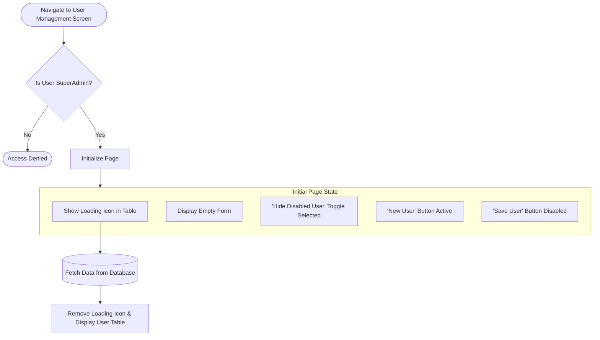
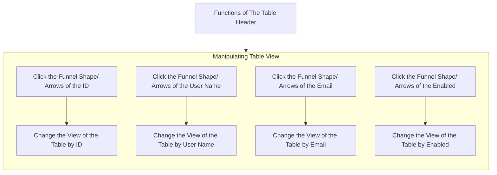
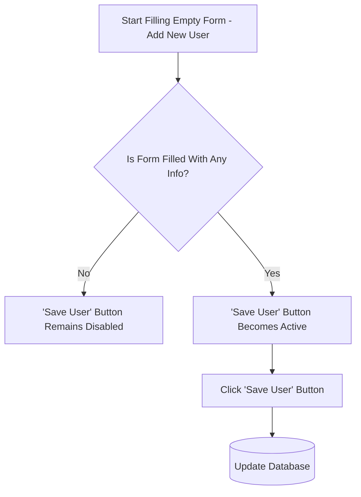

# User Management Screen

## Introduction

This is a document to define the specifications of the user management screen. This document provides:

- **Overall:** Defines the main purpose, goals of this page.

- **Initial State:** Shows the initial status of the page's components.

- **Components:** Explains each component's behaviours and what functions will be defined.

## Overall

This page is designed to manage users in the platform. The "User Management Screen" will be on **one page**. It will include features and these features will **only be visible and usable** for the **"SuperAdmin"** role. These features are:

-  Displaying the user table.

-  Manipulating the visibility of the user table by filtering and toggling.

-  Disabling the user without hard delete.

-  Adding a new user to the system.

-  Editing the user's information in the platform.

## Initial State

When the page opens:

- The user table will be displayed.
  
- While the information of users is loading from the database, in the middle of the table there should be a 'spinner' icon to show the user that the information is loading.

- The form will be displayed as empty.

- 'Hide Disabled User' toggle will be selected by default.

- 'New User' button will be active

- 'Save User' button will be disabled until the form is filled with any user information.

For clear understanding of the initial page status check the **flowchart** below:



## Page Features

Page main features will be determined in this section. Page background will be '#ffffff' hex code. The page will consist of three main UI units. The units are labelled as "Header", "Table" and "Form" in this document. 

The details for each components will be given in below.

### 1. Header

- The header background will be '#f5f5f5' hex code.
- The header of the page contains three units which they will be explained more in related sections below.

There are three units of the header. The units are:

#### 1.1 New User Button
- The New User Button will be on the left side of the header.
- The button backgorund will be '#2C74B3' hex code.
- The text colour will be '#FFFFFF' hex code.
- The initial state of the button will be active.

Detailed explanation of the New User Button will be explained [here.](#new-user)

#### 1.2 Hide Disabled Checkbox
- Right after the New User button, the Hide Disabled User Checkbox will come.
- The text colour will be '#333333' hex code.
- The initial state of the checkbox will be ticked.

Detailed explanation of the Hide Disabled Checkbox will be explained [here.](#hide-disabled-checkbox)

#### 1.3 Save User Button
- The Save User Button will be on the right side of the header.
- The button backgorund will be '#2C74B3' hex code.
- The initial state of the button will be disabled.

Detailed explanation of the Save User Button will be explained [here.](#save-user)

### 2. Table

The table will request and display the user information in a list row by row. 
- It will have 4 columns.
- The columns will be seperated by lines which have the colour of '#E5E5E5' hexacode.
- Inside the table, the 'Segoe UI' text font will be using.
- The Table sizes will be comprehensive design according to the page size.
- The Table will cover fixed %40 percent of the page in the vertical part.
- It will cover fixed %80 percent of the page by horizantally.
- The table will located on the left bottom of the page.
<a id="hide-disabled-checkbox" name="hide-disabled-checkbox">&zwj;</a>

#### Hide/Disabled Checkbox

In the header of the page, there will be a checkbox to hide disabled user from the view. 
- If the user make the checkbox active, then the records of the disabled user will be unvisible.
- If the user make the checkbox inactive, then all the data of the users will be shown in the table no matter of enable statue of the records.

To move back to the header part of the document, click [here.](#12-hide-disabled-checkbox)


The table consist of two main parts. The parts of the table are "Table Header" and "Table Body". More detailed explanation will be handed in below:

### 2.1 Table Header

The Table Header will display the titles and features manipulating options to table view.
- The Table Header will be sticky.
- The background of the table header will be '#2C74B3' hex code.
- The text in the header will be '#FFFFFF' hex code.
- The text in the header will be bold. 

In each column of the header, there will be title and symbols:

#### 2.1.1 The First Column
- There will be an 'ID' title with funnel shape and upside arrow.
- Symbols are right-aligned and title will be left aligned.
- The Funnel Shape will be the rightest. Arrow will come left to Funnel Shape.
- When user click the upside arrow, the table order will be changed by ascending by the ID number of the user.
- When the user click the funnel shape, there will be opening list, and give ability to the user to select which ID the user wants to select.

#### 2.1.2 The Second Column
- There will be a 'User Name' title with funnel shape and upside/ downside arrows.
- Symbols are right-aligned and title will be left aligned.
- The Funnel Shape will be the rightest.
- Arrows will come left to Funnel Shape.
- When user click the upside/ downside arrow, the table order will be changed by ascending/ descending by the User Name letters according to the alphabetic order of the user.
- When the user click the funnel shape, there will be opening list, and give ability to the user to select which User Name the user wants to select.

#### 2.1.3 The Third Column
- There will be a 'Email' title with funnel shape and upside/ downside arrow.
- Symbols are right-aligned and title will be left aligned.
- The Funnel Shape will be the rightest. Arrows will come left to Funnel Shape.
- When user click the upside/ downside arrow, the table order will be changed by ascending/ descending by the Email letters according to the alphabetic order of the user.
- When the user click the funnel shape, there will be opening list, and give ability to the user to select which Email the user wants to select.

#### 2.1.4 The Fourth Column
- There will be a 'Enabled' title with funnel shape and upside/ downside arrow.
- Symbols are right-aligned and title will be left aligned.
- The Funnel Shape will be the rightest. Arrows will come left to Funnel Shape.
- When user click the upside/ downside arrow, the table order will be changed by ascending/ descending by the enable statue of the user.
- When the user click the funnel shape, there will be opening list, and give ability to the user to select enable statue of the user wants to select.


### 2.2 Table Body

- The Table Body will display the user informations.
- The Table Body will be vertical overflow with a scrollbar.
- The displayed informations in each row will be reflected the user information belongs to the title of the column.
- The background of the Table Body will be '#FFFFFF' hex code.
- The colour of the text in the Body will be '#333333' hex code.
- The text in the header will be regular boldness.

Each column, different details will be displayed.
- In the first column, the user ID will be placed right-aligned.
- The second column will display the User Name by left-aligned.
- The email details of the user will be located in the third column of the Table Body.
- The fourth column will display the user Enable statue.

  #### 2.2.1 Modifying User Information
  
  The table gives ability to the user to select one of the user by clicking once and change that user's records through the form. The process of the modification user's records are:
  
  - Select the appropriate user by clicking once.
  - The row of the selected user will be highlighted by changing the background of that row.
  - The background colour of that row will be '#BDD3E5' hexacode.
  - The form which is located in the right side of the table, will be populated with the records of the selected user.
  - When the end-user change any records of the selected user, the "Save User" Button will be active and clickable.
  - After the changes are made the user will click the save user button.
  - The database will be updated with new parameters of the selected user.
  - The Table Body will refresh and fetch the latest records from the Database.
    <br><br>
  ```mermaid
  
    graph TD
         %% User Actions from Inside the Table    
    
        InsideTable[Inside Table Actions] --> ActionEdit[Click a User Row in Table - Edit/Disable User]
        %% Edit Existing User Flow
        ActionEdit --> HighlightRow[Clicked Row is Highlighted]
        HighlightRow --> PopulateForm[Form Populates with User Data]
        PopulateForm --> EditOptions{Edit Actions}
        
        EditOptions --> ModifyInfo[Modify User Information]
        EditOptions --> ToggleEnabled[Toggle 'Enabled' Switch inside Form - Soft Delete/Activate]
        
        ModifyInfo --> CheckChanges{Are There Any Changes Made?}
        ToggleEnabled --> CheckChanges
    
        %% Save Button Activation Logic
        CheckChanges -- No --> KeepSaveDisabled['Save User' Button Remains Disabled]
        
        CheckChanges -- Yes --> ActivateSave['Save User' Button Becomes Active]
    
        %% Save and Refresh Process
        ActivateSave --> ClickSave[Click 'Save User' Button]
        ClickSave --> UpdateDB[(Update Database)]
        
    ```

### 3. Form

The form will include empty boxes, opening list and checkbox. In these boxes, user will be able to enter various user information to save the user information to the system through the form. 

In the header, there is two button to affect this section. The buttons functionality will be explained below more:
<a id="new-user" name="new-user">&zwj;</a>

#### New User Button

- The new user button will erase all the inputs of the form to initial value, which is empty.
- The new user button always will be active to give the ability to end-user to clear the form.

To move back to the header part of the document, click [here.](#11-new-user-button)
<a id="save-user" name="save-user">&zwj;</a>
#### Save User Button

- The save user button will be active if the form filled with any user information.
- Clicking the save user button will send the entered information to the database.
- Save user button will listen database response.
- If the parameters have saved to the database, the form will be cleaned.
- If saving response from the database is saying the saving process has failed, then the form will be stayed with that info and give the end-user an error message to explain and make user aware of that error.

Here is a brief explanation of what is user actions and how the system should response to the actions of the end-user. There is the flowchart:


To move back to the header part of the document, click [here.](#13-save-user-button)

In the form, there will be four of empty boxes which gives ability to user to enter the data. These are

- **Username**: The text box which will allow user to enter username.
- **Display Name**: The text box which will allow the end user to enter the name which will be displayed
- **Phone**: The input box which will allow the end-user to enter only digits.
- **Email**: The input box which will allow the end-user to fill the user's email adress. The allowed form will be '?@?'

After these input boxes, there will be a list selection box. Which is titled by:
- **User Roles**: Give the ability to user by clicking on that box there is an opening list of roles. These roles are 'Guest', 'Admin' and 'SuperAdmin'.
  - The initial state of the list box is showing a message to user which is 'Select user roles...'
  - When user click the box, the list of roles will be opened.
  - The initial state for the first opening of the list is 'Guest' option is highlighted.
  - The user will be able to change the highlighted role through the mouse point and through the up and down arrows in the keyboard.

After the list selection box, there will be a checkbox for Enable or Disable the user statue. Which is titled by:
- **Enabled**: The checkbox will allow the user to change the statue of the user to be active or passive.
  - The initial state for the checkbox is unselected.
  - If the end-user click the box, the statue of the user which is in the form will be change.
  - If the checkbox ticked, then the user statue will change as active.
  - If the checkbox is not selected, then the user statue is remains disabled.


