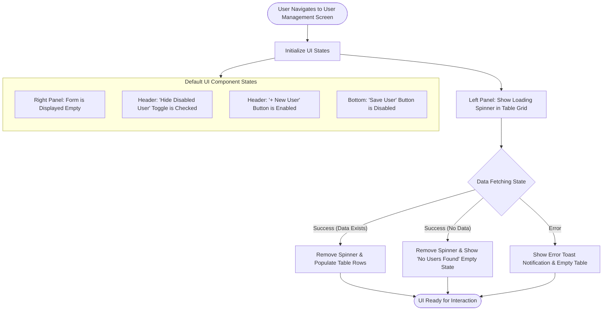
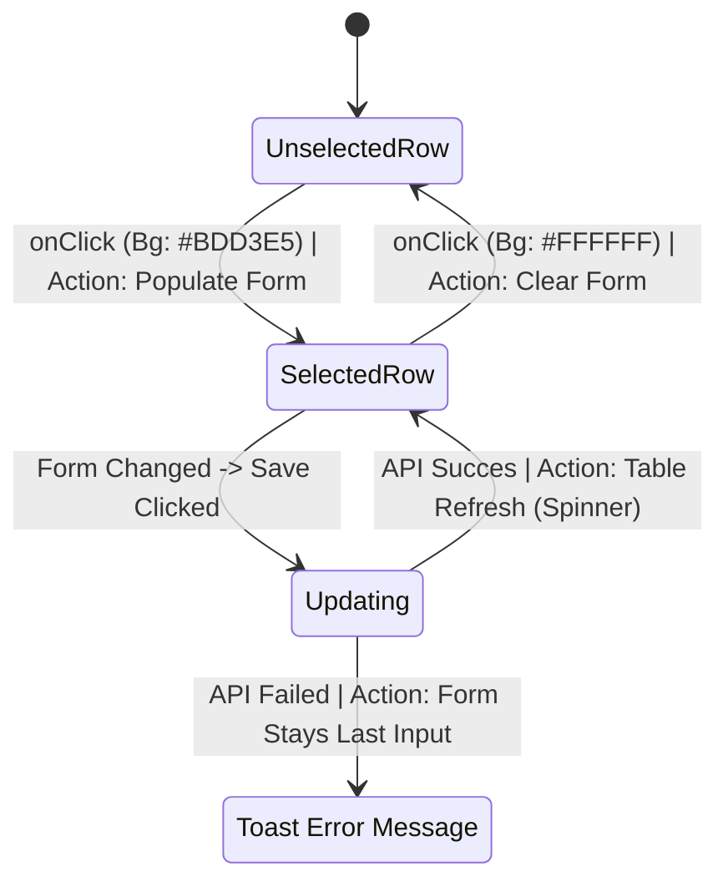

# User Management Screen

## 1) Core Features
-  User List.
-  Filtering/Toggling the List.
-  User Creation & Modification by Form.

## 2) Initial State
When the page opens, the components will be rendered with the following default states and rules:

| Component | Initial State | Details / Validation |
| :--- | :--- | :--- |
| **User Table (Loading)** | Displays Spinner | A spinner icon is shown in the middle of the table. |
| **User Table (Loaded)** | Ascending Order | Once loaded, the table displays user data ordered by ID in ascending order by default. |
| **User Form** | Empty | All input fields in the form are completely empty. |
| **'Hide Disabled User' Toggle** | Ticked | Disabled users hid by default. |
| **'New User' Button** | Active | Ready to be interacted. |
| **'Save User' Button** | Disabled | Remains disabled until *User Name, Phone, Email,* and *User Roles* are filled.   <a id="assumption" name="assumption">&zwj;</a>*(_Assumption: Because of there is no specification in the task assignment, the given user information are assumed as mandatory to provide reliable system._)* |

### Initial State Flowchart

## 3) Page Features

- **Page Background:** `#ffffff`
- **Layout:** Consists of three main UI units ('Header', 'Form', and 'Table').
- **Spacing:** The space-between units will be responsive.

### 1. Header

- **Position:** Located on the top of the page.
- **Background:** `#f5f5f5`
- **Text Features:** All text in the header units will be **bold**.
- **Layout:** Contains three sub-units with responsive space-between.

#### Header Components

| Component | Position | Initial State | Background (Default/Hover/Disabled) | Text Color | Notes |
| :--- | :--- | :--- | :--- | :--- | :--- |
| **New User Button** | Left | Active | `#2C74B3` / `#20527D` / - | `#FFFFFF` | See detailed explanation [here.](#new-user) |
| **Hide Disabled Checkbox** | Middle (Next to New User) | Ticked | - | `#333333` | See detailed explanation [here.](#hide-disabled-checkbox) |
| **Save User Button** | Right | Disabled | `#2C74B3` / `#20527D` / `#CCCCCC` | - | `cursor: not-allowed` when disabled. See detailed explanation [here.](#save-user) |

### 2. Table

**Table & Layout Attributes**
- **Layout:** Located on the left side under the header, stretches to fill the remaining screen height (with internal vertical scrolling).
- **Columns:** 4
- **Styling:** Font: 'Segoe UI', Column Separator / Border Color: `#E5E5E5`
<a id="hide-disabled-checkbox" name="hide-disabled-checkbox">&zwj;</a>
#### Hide/Disabled Checkbox

Located in the header, this checkbox toggles the visibility of disabled user accounts in the table.

  
<strong>Filter Logic: Hide Disabled Users</strong>

  
   

  * **State:** Bound to a local state (e.g., `isHideDisabledActive`) with an **initial state = `true`**.
  * **When `true` (Active):** The user array fetched from the database is filtered before rendering. Any user object containing an `isDisabled === true` (or equivalent) flag will not be rendered in the DOM.
  * **When `false` (Inactive):** The complete user list is mapped and rendered directly without any filtering manipulation, showing all users regardless of their status.
  
   
  
  [↑ Return to Header Components](#header-components)

### 2.1 Table Header

The Table Header displays column titles and gives the user the ability to manipulate the view.

**Styling & Layout:**
- **Position:** `sticky` | **Top**
- **Background:** `#2C74B3`
- **Text:** `#FFFFFF` | **Bold**

> **Header Cell Layout:** Uses flexbox alignment. The header text is always left-aligned, while the action icons are right-aligned. The **Sort Icon** is always placed to the left of the **Filter Icon**.

**Icon Actions:**
* **Sort Icon (`onClick`):** Toggles the table view between ascending / descending order (alphabetical or numerical, depending on the column's data type).
* **Filter Icon (`onClick`):** Opens a dropdown menu. Allowing the user to select specific parameters to filter the respective column data.

**Column Specifications:**

| Column Name | Sortable (Arrow Icon) | Filterable (Funnel Icon) | Data Type |
| :--- | :---: | :---: | :--- |
| **ID** | Yes | Yes | Numeric |
| **User Name** | Yes | Yes | Alphabetic |
| **Email** | Yes | Yes | Alphabetic |
| **Enabled** | Yes | Yes | Boolean |

### 2.2 Table Body

**Styling & Layout:**
- **Background (Default/Hover):** `#FFFFFF` / `#F5F5F5` 
- **Text:** `#333333` | **Regular**
- **Behaviour:** Clickable
- **Scrolling:** Within a vertical scroll.

| Column Name | Alignment | 
| :--- |  :--- |
| **ID** | Right |
| **User Name** | Left |
| **Email** | Left |
| **Enabled** | Left |

#### 2.2.1 Row Selection & User Interaction

#### Additional UI Events

- **Event:** `onFormChange` ➔ **State Change:** "Save User" button state changes from disabled to active ➔ **Trigger:** Button becomes clickable.
- **Event:** `onSaveSuccess` ➔ **State Change:** Spinner displays in the middle of the table with an informational message ➔ **Trigger:** Informs user that latest parameters are loading.
- **Event:** `onHover` ➔ **State Change:** Row Background becomes `#F5F5F5` ➔ **Trigger:** Visually indicates to the user that the row can be deselected.

### 3. Form Schema & Validation

  
<strong>New User Button</strong>
<a id="new-user" name="new-user">&zwj;</a>
  
   

  * **State:** Always **Active** to ensure the end-user can clear the form at any time.
  * **Action (`onClick` / `onReset`):** Clears all form fields, strictly resetting them to their **Initial States**.

  [↑ Return to Header: New User Button](#11-new-user-button)
   

  
<strong>Save User Button & Submission Lifecycle</strong>
<a id="save-user" name="save-user">&zwj;</a>
   
The "Save User" button triggers submission process for creating new user.

  * **1. Active State:** The button becomes **Active** only when all mandatory form fields are filled properly.
  * **2. Submitting:** Triggered `onClick`.
      * **UI State:** All form inputs and the Save button become `disabled` to prevent multiple submissions.
      * **Feedback:** A spinner icon is displayed in the center of the button.
  * **3. Success:** * **Condition:** API returns a success response.
      * **UI State:** The form is cleared completely.
      * **Feedback:** A success toast message appears.
  * **4. Error:**
      * **Condition:** API returns an error response.
      * **UI State:** The form is NOT cleared; it stays with the user's last inputs.
      * **Feedback:** An error toast message appears.
  
  [↑ Return to Header: Save User Button](#13-save-user-button)
   

**Global Rule:** All text inputs have a max-length of 255 characters unless specified otherwise. A `*` sign will be used to indicate mandatory fields (according to the [assumption](#assumption)).

| Field Name | Type | Required | Default State | Validation / Notes |
| :--- | :--- | :---: | :--- | :--- |
| **Username** | Text Input | Yes | Empty | - |
| **Display Name** | Text Input | No | Empty | - |
| **Phone** | Numeric Input | Yes | Empty | Only digits and the `+` sign are allowed. |
| **Email** | Text Input | Yes | Empty | Standard email validation rules apply. |
| **User Roles** | Dropdown | Yes | `'Select user roles...'` | Options: `'Guest'`, `'Admin'`, `'SuperAdmin'`. In the first opening, the `'Guest'` option is highlighted. |
| **Enabled** | Checkbox | No | Unchecked | Interaction: Ticked = Active, Unticked = Disabled. |

