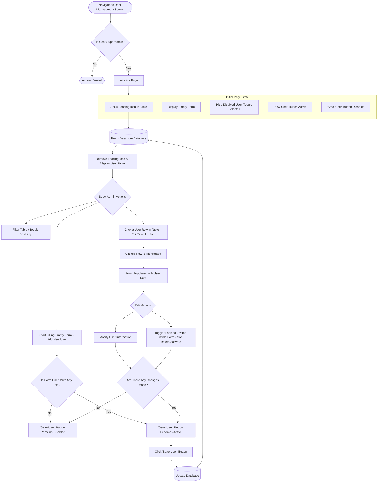

# User Management Screen

## Introduction

This is a document to define the specifications of the user management screen. This document provides:

- **Overall:** Defines the main purpose, goals of this page.

- **Initial State:** Shows the initial status of the page's components.

- **Components:** Explains each component's behaviours and what functions will be defined.

## Overall

This page is designed to manage users in the platform. The "User Management Screen" will be on **one page**. It will include features and these features will **only be visible and usable** for the **"SuperAdmin"** role. These features are:

-  Displaying the user table.

-  Manipulating the visibility of the user table by filtering and toggling.

-  Disabling the user without hard delete.

-  Adding a new user to the system.

-  Editing the user's information in the platform.

## Initial State

When the page opens:

- The user table will be displayed.
  
- While the information of users is loading from the database, in the middle of the table there should be a 'spinner' icon to show the user that the information is loading.

- The form will be displayed as empty.

- 'Hide Disabled User' toggle will be selected by default.

- 'New User' button will be active

- 'Save User' button will be disabled until the form is filled with any user information.

For clear understanding of the initial page status check the **flowchart** below:

# Components
Details related to components
Behavior of the page commponents

**FEATURES**
- New User
- User Table (ID, user name, email, user ability[they are filtered])
- Hide Disabled User Feature
- Adding new user form (username, display name, phone, email, user roles[guest, admin, super admin], account ability, save user)

